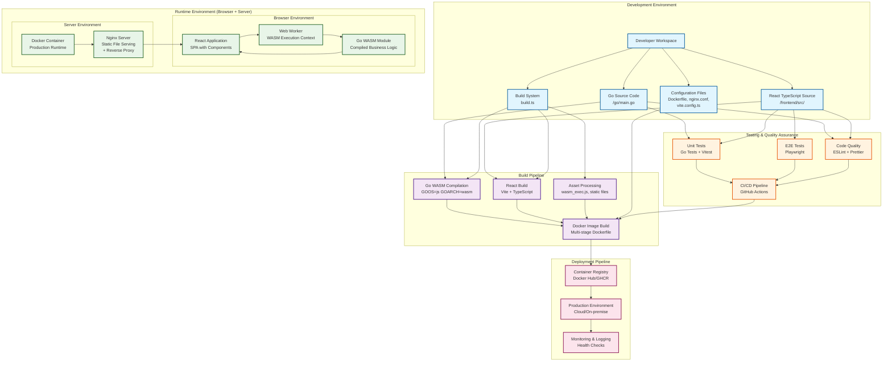
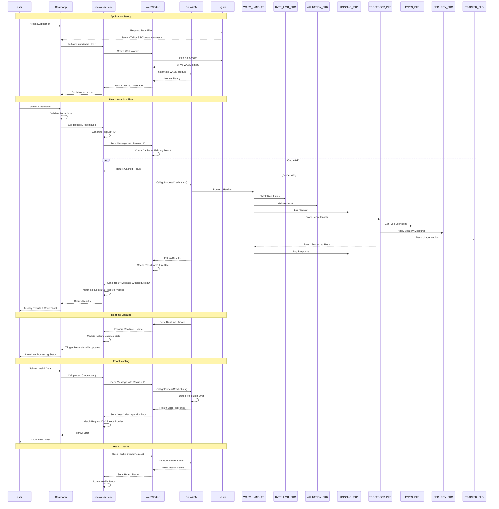

# WASM App with Go and React

## Project Overview

This project delivers a robust WebAssembly (WASM) application with Go handling backend logic compiled to WASM and React p    WASM_WORKER --> WASM_HANDLER
    WASM_HANDLER --> MAIN

    WASM_HANDLER --> PROCESSOR_PKG
    WASM_HANDLER --> VALIDATION_PKG
    WASM_HANDLER --> LOGGING_PKG
    WASM_HANDLER --> RATE_LIMIT_PKG

    PROCESSOR_PKG --> TYPES_PKG
    PROCESSOR_PKG --> SECURITY_PKG
    VALIDATION_PKG --> TYPES_PKG
    LOGGING_PKG --> TRACKER_PKG
    RATE_LIMIT_PKG --> TRACKER_PKG

    CREDENTIAL_FORM --> WASM_HOOK
    ENV_SELECTOR --> WASM_HOOK
    RESULT_DISPLAY --> WASM_HOOK

    APP --> TOAST_SYSTEM
    CREDENTIAL_FORM --> FORM_VALIDATION
    RESULT_DISPLAY --> JSON_VIEWERtive frontend. The app securely transmits three essential variables (client ID, client secret, and environment) from the React UI into the Go WASM module for processing. Enhancements focus on improved security, advanced error handling, asynchronous processing, and optimized performance. The integration with Nginx ensures efficient serving of static files in production, resulting in a scalable, secure, and easy-to-deploy solution.

## Architecture

### Development Workflow & Build Pipeline



### Component Architecture

```mermaid
graph TD
    subgraph "React Frontend Architecture"
        APP[App.tsx<br/>Main Application]
        CREDENTIAL_FORM[CredentialForm<br/>forms/CredentialForm.tsx<br/>Input Validation]
        ENV_SELECTOR[EnvironmentSelector<br/>forms/EnvironmentSelector.tsx<br/>Environment Dropdown]
        RESULT_DISPLAY[ResultDisplay<br/>ResultDisplay.tsx<br/>JSON Viewer]
        LOADING_SPINNER[LoadingSpinner<br/>LoadingSpinner.tsx<br/>Async States]
        ERROR_BOUNDARY[ErrorBoundary<br/>error/ErrorBoundary.tsx<br/>Error Handling]
        WASM_HOOK[useWasm<br/>hooks/useWasm.ts<br/>WASM Integration & Web Worker]
    end

    subgraph "Go WASM Module Architecture"
        MAIN[main.go<br/>Entry Point<br/>WASM Initialization]
        WASM_HANDLER[Handler<br/>internal/wasm/handler.go<br/>Request Processing<br/>Async Operations]
        HANDLER_MOCK[Handler Mock<br/>internal/wasm/handler_mock.go<br/>Testing Support]

        PROCESSOR_PKG[Processing Package<br/>pkg/processing/<br/>Business Logic<br/>Environment Config]
        VALIDATION_PKG[Validation Package<br/>pkg/validation/<br/>Input Validation<br/>Security Checks]
        LOGGING_PKG[Logging Package<br/>pkg/logging/<br/>Structured Logging<br/>Error Tracking]
        RATE_LIMIT_PKG[Rate Limiting<br/>pkg/ratelimit/<br/>Request Throttling<br/>DDoS Protection]
        SECURITY_PKG[Security Package<br/>pkg/security/<br/>Encryption<br/>Credential Protection]
        TRACKER_PKG[Tracker Package<br/>pkg/tracker/<br/>Usage Analytics<br/>Performance Metrics]
        TYPES_PKG[Types Package<br/>pkg/types/<br/>Data Models<br/>Type Definitions]
    end

    subgraph "Web Worker Architecture"
        WASM_WORKER[wasm-worker.js<br/>Web Worker<br/>/frontend/public/wasm-worker.js]
        WORKER_COMM[Worker Communication<br/>Message Passing<br/>Request/Response Pattern]
        REQUEST_MANAGER[Request Manager<br/>Request ID Tracking<br/>Promise Resolution]
        CACHE_SYSTEM[Cache System<br/>Result Caching<br/>TTL Management<br/>FIFO Eviction]
        REALTIME_UPDATES[Realtime Updates<br/>Live Status Updates<br/>Background Processing]
    end

    subgraph "UI Components & Libraries"
        TOAST_SYSTEM[Toast Notifications<br/>react-toastify<br/>User Feedback]
        FORM_VALIDATION[Form Validation<br/>HTML5 + Custom<br/>Input Sanitization]
        JSON_VIEWER[JSON Viewer<br/>Syntax Highlighting<br/>Pretty Printing]
    end

    subgraph "Build System Architecture"
        BUILD_SCRIPT[build.ts<br/>Orchestrator]
        GO_COMPILER[Go Compiler<br/>WASM Target]
        VITE_BUILDER[Vite Builder<br/>React Bundle]
        ASSET_MANAGER[Asset Manager<br/>File Operations]
        DOCKER_BUILDER[Docker Builder<br/>Containerization]
    end

    %% Component Relationships
    APP --> CREDENTIAL_FORM
    APP --> ENV_SELECTOR
    APP --> RESULT_DISPLAY
    APP --> LOADING_SPINNER
    APP --> ERROR_BOUNDARY
    APP --> WASM_HOOK

    WASM_HOOK --> WASM_WORKER
    WASM_WORKER --> WORKER_COMM
    WORKER_COMM --> REQUEST_MANAGER
    WORKER_COMM --> CACHE_SYSTEM
    WORKER_COMM --> REALTIME_UPDATES

    WASM_WORKER --> MAIN
    CREDENTIAL_FORM --> WASM_HOOK
    ENV_SELECTOR --> WASM_HOOK
    RESULT_DISPLAY --> WASM_HOOK

    APP --> TOAST_SYSTEM
    CREDENTIAL_FORM --> FORM_VALIDATION
    RESULT_DISPLAY --> JSON_VIEWER

    MAIN --> CREDENTIALS
    MAIN --> PROCESSOR
    PROCESSOR --> VALIDATOR
    PROCESSOR --> ENV_HANDLER
    PROCESSOR --> ERROR_HANDLER

    BUILD_SCRIPT --> GO_COMPILER
    BUILD_SCRIPT --> VITE_BUILDER
    BUILD_SCRIPT --> ASSET_MANAGER
    BUILD_SCRIPT --> DOCKER_BUILDER

    GO_COMPILER --> MAIN
    VITE_BUILDER --> APP
    ASSET_MANAGER --> WASM_WORKER
    DOCKER_BUILDER --> BUILD_SCRIPT
```



### Data Flow Architecture



## Requirements

### Functional Requirements

- Compile Go code to WebAssembly for browser execution.
- React frontend securely passes client ID, client secret, and environment to the Go WASM module.
- Go WASM module processes variables, applies environment-specific logic, and returns structured results to React.
- Maintain high security for sensitive credentials (e.g., avoid persistent storage, use secure transmission).
- Support multiple environments (development, staging, production) with configurable behaviors.
- Handle asynchronous operations to prevent UI blocking.
- Provide user feedback for loading states, errors, and successes.

### Technical Requirements

- Go 1.21+ (with WebAssembly support for browser execution and modular architecture).
- React 18+ for the frontend, with hooks for state management and TypeScript for type safety.
- Vite for bundling (preferred over Webpack for faster development and builds).
- Web Workers for non-blocking WASM execution with caching and request management.
- Docker for containerization and deployment with multi-stage builds.
- Nginx for serving static files with compression, caching, and security headers.
- Modular Go architecture with separate packages for:
  - Processing (business logic and environment configuration)
  - Validation (input validation and security checks)
  - Logging (structured logging and error tracking)
  - Rate limiting (request throttling and DDoS protection)
  - Security (encryption and credential protection)
  - Tracking (usage analytics and performance metrics)
  - Types (data models and type definitions)

## Tasks

### Setup Phase

- [x] Set up the Go development environment with WebAssembly support (Go 1.21+).
- [x] Create a new React project using Vite for faster bundling and HMR.
- [x] Organize project structure: `/go` for Go code, `/frontend` for React code, `/nginx` for config files.
- [x] Configure Vite to handle WASM files (e.g., via plugins for binary loading).
- [x] Add ESLint and Prettier for code quality in React.

### Go WASM Development

- [x] Create the main Go package with modular structure.
- [x] Implement asynchronous functions to receive and process variables from JavaScript.
- [x] Enhance security: Validate inputs, hash secrets temporarily if needed, and avoid logging sensitive data.
- [x] Expand environment-specific logic (e.g., simulate API calls via JS bridge).
- [x] Add comprehensive error handling, structured logging, and panic recovery.
- [x] Build and test Go to WASM, optimizing binary size with build flags.
- [x] Use Go's WebAssembly features for non-blocking operations.

### React Frontend Development

- [x] Set up component structure with separate files for forms, results, and loaders.
- [x] Implement lazy loading and initialization of the WASM module in a Web Worker.
- [x] Create a secure form with password masking, validation, and auto-clear on submit.
- [x] Add environment selector with dropdown and tooltips for clarity.
- [x] Develop a responsive interface for displaying results, including JSON pretty-printing.
- [x] Implement advanced error handling, toast notifications, and loading spinners.
- [x] Use TypeScript for type safety in React components.

### Integration

- [x] Bridge React and Go WASM with promise-based calls for async data flow.
- [x] Test variable passing in various scenarios (e.g., invalid inputs, different environments).
- [x] Optimize WASM execution by offloading to Web Workers and caching results.
- [x] Implement bi-directional communication for real-time updates if needed.

### Testing and Deployment

- [x] Write unit tests: Go tests for WASM logic, Jest/Vitest for React components.
- [x] Perform end-to-end integration testing with Cypress or Playwright.
- [x] Set up a CI/CD build pipeline (e.g., GitHub Actions) for automated builds and tests.
- [x] Create deployment scripts, including Docker for containerization.
- [x] Configure Nginx for production serving with caching, compression, and HTTPS.
- [x] Document the full deployment process, including environment variable setup.

## Implementation Details

### Go WASM Module Structure

```go
package main

import (
    "syscall/js"
    "encoding/json"
    "fmt"
    "runtime/debug"
    "strings"
)

type Credentials struct {
    ClientID     string `json:"clientId"`
    ClientSecret string `json:"clientSecret"`
    Environment  string `json:"environment"`
}

func processCredentials(this js.Value, args []js.Value) any {
    defer func() {
        if r := recover(); r != nil {
            fmt.Printf("Recovered from panic: %v\nStack: %s\n", r, debug.Stack())
            js.Global().Get("console").Call("error", fmt.Sprintf("Go panic: %v", r))
        }
    }()

    if len(args) != 1 {
        return js.ValueOf(map[string]any{"error": "Invalid number of arguments"})
    }

    // Parse credentials
    var creds Credentials
    credJSON := args[0].String()
    if err := json.Unmarshal([]byte(credJSON), &creds); err != nil {
        return js.ValueOf(map[string]any{"error": fmt.Sprintf("Failed to parse: %v", err)})
    }

    // Validate inputs
    if creds.ClientID == "" || creds.ClientSecret == "" || !isValidEnvironment(creds.Environment) {
        return js.ValueOf(map[string]any{"error": "Invalid credentials or environment"})
    }

    // Process asynchronously (simulate async support)
    result := processBasedOnEnvironment(creds)

    return js.ValueOf(map[string]any{
        "success": true,
        "result":  result,
    })
}

func isValidEnvironment(env string) bool {
    valid := []string{"development", "staging", "production"}
    for _, v := range valid {
        if strings.EqualFold(env, v) {
            return true
        }
    }
    return false
}

func processBasedOnEnvironment(creds Credentials) map[string]string {
    // Enhanced logic: Simulate environment-specific processing, e.g., config generation
    config := map[string]string{
        "baseURL": "",
        "authMode": "basic",
    }
    switch creds.Environment {
    case "development":
        config["baseURL"] = "http://localhost:8080"
        config["authMode"] = "debug"
    case "staging":
        config["baseURL"] = "https://staging.example.com"
        config["authMode"] = "test"
    case "production":
        config["baseURL"] = "https://api.example.com"
        config["authMode"] = "secure"
    }
    // Simulate using credentials (e.g., hash or token generation, but keep client-side)
    config["tokenHint"] = fmt.Sprintf("Token for %s (secret hashed)", creds.ClientID)
    return config
}

func main() {
    c := make(chan struct{}, 0)
    
    // Register async function
    js.Global().Set("goProcessCredentials", js.FuncOf(processCredentials))
    
    fmt.Println("WASM Go Initialized")
    <-c // Block to keep running
}
```

### React Integration (with TypeScript)

```tsx
import React, { useState, useEffect } from 'react';
import './App.css';

interface Credentials {
  clientId: string;
  clientSecret: string;
  environment: string;
}

interface Response {
  success?: boolean;
  result?: any;
  error?: string;
}

const App: React.FC = () => {
  const [clientId, setClientId] = useState('');
  const [clientSecret, setClientSecret] = useState('');
  const [environment, setEnvironment] = useState('development');
  const [result, setResult] = useState('');
  const [loading, setLoading] = useState(false);
  const [wasmLoaded, setWasmLoaded] = useState(false);
  const [error, setError] = useState('');

  // Lazy load WASM in a Web Worker for non-blocking
  useEffect(() => {
    const loadWasm = async () => {
      try {
        const go = new (window as any).Go();
        const result = await WebAssembly.instantiateStreaming(
          fetch('/main.wasm'),
          go.importObject
        );
        go.run(result.instance);
        setWasmLoaded(true);
      } catch (err) {
        console.error('WASM load failed:', err);
        setError('Failed to load WASM module');
      }
    };

    if ((window as any).Go) {
      loadWasm();
    } else {
      const script = document.createElement('script');
      script.src = '/wasm_exec.js';
      script.onload = loadWasm;
      document.head.appendChild(script);
    }
  }, []);

  const handleSubmit = async (e: React.FormEvent) => {
    e.preventDefault();
    if (!wasmLoaded) {
      setError('WASM not loaded');
      return;
    }
    setLoading(true);
    setError('');
    setResult('');

    try {
      const credentials: Credentials = { clientId, clientSecret, environment };
      const response: Response = (window as any).goProcessCredentials(JSON.stringify(credentials));

      if (response.error) {
        setError(`Error: ${response.error}`);
      } else {
        setResult(JSON.stringify(response.result, null, 2));
      }
      // Clear sensitive fields
      setClientSecret('');
    } catch (err) {
      setError(`Unexpected error: ${(err as Error).message}`);
    } finally {
      setLoading(false);
    }
  };

  return (
    <div className="App">
      <header className="App-header">
        <h1>Go WASM with React (Enhanced)</h1>
      </header>
      <main>
        <form onSubmit={handleSubmit}>
          <div className="form-group">
            <label htmlFor="clientId">Client ID:</label>
            <input
              type="text"
              id="clientId"
              value={clientId}
              onChange={(e) => setClientId(e.target.value.trim())}
              required
              pattern="^[a-zA-Z0-9-]+$"
              title="Alphanumeric with hyphens only"
            />
          </div>
          <div className="form-group">
            <label htmlFor="clientSecret">Client Secret:</label>
            <input
              type="password"
              id="clientSecret"
              value={clientSecret}
              onChange={(e) => setClientSecret(e.target.value)}
              required
              minLength={8}
            />
          </div>
          <div className="form-group">
            <label htmlFor="environment">Environment:</label>
            <select
              id="environment"
              value={environment}
              onChange={(e) => setEnvironment(e.target.value)}
            >
              <option value="development">Development</option>
              <option value="staging">Staging</option>
              <option value="production">Production</option>
            </select>
          </div>
          <button type="submit" disabled={loading || !wasmLoaded}>
            {loading ? 'Processing...' : 'Submit'}
          </button>
        </form>
        {error && <div className="error">{error}</div>}
        {result && (
          <div className="result">
            <h2>Result:</h2>
            <pre>{result}</pre>
          </div>
        )}
        {!wasmLoaded && <p>Loading WASM module...</p>}
      </main>
    </div>
  );
};

export default App;
```

## Build Process

### Compiling Go to WASM

```bash
# Set environment for WASM (Go 1.21+ optimizations)
GOOS=js GOARCH=wasm go build -o public/main.wasm -ldflags="-s -w" -trimpath

# Copy wasm_exec.js
cp "$(go env GOROOT)/misc/wasm/wasm_exec.js" public/
```

### Building the React App (with Vite)

```bash
# Install dependencies (add vite-plugin-wasm if needed)
npm install vite @vitejs/plugin-react vite-plugin-wasm

# Start development server
npm run dev

# Build for production
npm run build
```

### Using the Custom Build System

The project includes a comprehensive build system (`build.ts`) that orchestrates the entire build process:

```bash
# Run the complete build pipeline
deno run --allow-read --allow-write --allow-run --allow-net build.ts

# The build system handles:
# - Go WASM compilation
# - React/TypeScript building
# - Asset copying and optimization
# - Docker image building
# - Development server setup
```

## Nginx Configuration for Deployment

Use Nginx to serve the built React app and WASM files with compression, caching, and security headers.

### Example Nginx Config (/nginx/nginx.conf)

```nginx
server {
    listen 80;
    server_name example.com;
    root /usr/share/nginx/html;  # Point to React build directory

    # Enable gzip compression
    gzip on;
    gzip_types application/wasm application/javascript text/css;

    # Cache static files
    location ~* \.(wasm|js|css|png|jpg|jpeg|gif|ico)$ {
        expires 30d;
        add_header Cache-Control "public";
    }

    # Serve index.html for SPA routing
    location / {
        try_files $uri /index.html;
    }

    # Security headers
    add_header X-Content-Type-Options nosniff;
    add_header X-Frame-Options DENY;
    add_header X-XSS-Protection "1; mode=block";

    # Redirect to HTTPS in production
    if ($scheme != "https") {
        return 301 https://$host$request_uri;
    }
}
```

### Deployment Script Example (Dockerized)

```bash
# Build Go WASM
GOOS=js GOARCH=wasm go build -o dist/main.wasm

# Build React
npm run build

# Dockerfile
FROM nginx:alpine
COPY dist /usr/share/nginx/html
COPY nginx/nginx.conf /etc/nginx/conf.d/default.conf
EXPOSE 80
CMD ["nginx", "-g", "daemon off;"]
```

## Deployment

For detailed deployment instructions, see [DEPLOYMENT.md](./DEPLOYMENT.md).

### Quick Start

```bash
# Setup development environment
./scripts/setup-dev.sh

# Run tests
./scripts/deploy.sh test

# Deploy locally
./scripts/deploy.sh deploy-local

# Deploy to production
SERVER=user@server.com ./scripts/deploy.sh deploy-remote
```

## Security Considerations

- Never store secrets persistently; clear them after use.
- Use Content-Security-Policy (CSP) headers in Nginx to restrict WASM execution.
- Validate all inputs in Go to prevent injection.
- Employ HTTPS via Nginx; use Let's Encrypt for certs.
- Avoid exposing secrets in logs or errors; use generic messages.
- Consider WebAuthn for future credential handling.

## Performance Optimization

- Use Go build flags (-ldflags="-s -w") to strip debug info and reduce WASM size.
- Implement memoization in React for repeated submissions.
- Run WASM in Web Workers to offload heavy computations.
- Lazy-load WASM only on form interaction.
- Use Nginx caching and brotli compression for faster delivery.
- Profile with browser dev tools and Go's pprof (adapted for WASM).

## Future Enhancements

- Integrate real API calls via JS fetch bridge in WASM.
- Add authentication flows (e.g., OAuth simulation).
- Support internationalization (i18n) in React.
- Implement monitoring with Sentry for errors.
- Explore Go's experimental async/await in future versions for smoother JS interop.
